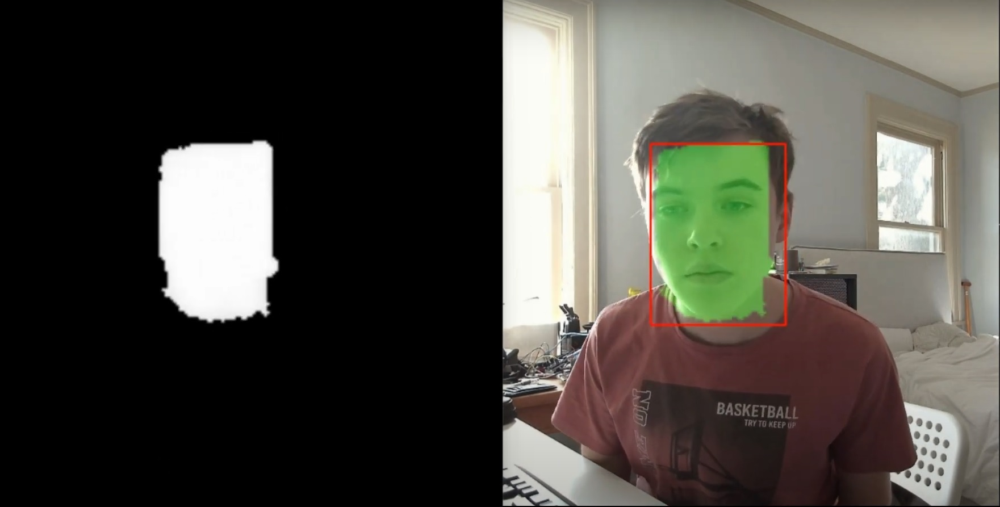

# Face Detector Net

This is a convolutional deep neural network (CNN) that detetecs faces. 

[This is the video demo for this project](https://youtu.be/VsAW3llS7NM)

This DNN takes an RGB image as its input and outputs a tensor where each pixel has a vector with 5 elements. The first value is how likely it is that there is a face there, other values are coordinates and sizes for the face bounding box which this pixel belongs to. The bounding box values are: a vector pointing to the upper left corner of the bounding box from the pixel's coordinates, and the bounding box's width and height. This DNN has 13 convolutional layers and 8 deconvolution layers. In the convolutional layers the images size is decreased by a factor of 2, 4 times. Deconvolutional layers increase the image by a factor of 2, 2 times.

[This video](https://youtu.be/VsAW3llS7NM) shows the computed face mask (on the left side). The white blob contains thresholded higher likelihood pixels which are considered to be a face by the DNN. A few random white pixels may show up where there isn't a face, but post proccessing removes them.

After the DNN returns a result, we need to create the bounding box around the face from computed pixel level output data in returned tensor. This is done in the post-processing step. It finds all the groups of pixels that are connected, then checks to make sure the amount of pixels in that group is more than a certain threshhold to cast out any stray pixels. Since each pixel has values for a bounding box, it takes the average of all the values to compute the final bounding box for the given face. This post-processing is done in the provided program <name>.

Another way we could have made this DNN was by outputing array of coordinates for all bounding boxes rather than ouputing data per every pixel. But this would limit the amount of faces it can find because there would be a limited set of elements in an array returned by the DNN. This is not a problem for this project since I trained it to compute face data per pixel and then post-process it.

### Testing the DNN:
If you want to run this model yourself download the FaceDetector folder. To test the DNN run: `python model_tester.py` program. 
If something doesn't work make sure to check the path to the model. Results may be worse in artificial light.

### Training the DNN:
You need to download the ["wider faces dataset"](http://shuoyang1213.me/WIDERFACE/). Get data, labels/annotations, for training and validation datasets. You will need the directories: "wider_face_split", "WIDER_train", and "WIDER_val". It may be easier to also put all these folders in a directory called "Data". Then download the "FaceDetector" directory up top and copy the "Data" directory into that folder. 

To train the DNN run `python face_finder_AI.py`. If something doesn't work scroll to the bottom of the file where all the paths are specified and make sure they are all correct. The pre-trained model is in the directory FaceDetector trained for 165 epochs. It takes up to 100-200 epochs to see good results.

Wider Faces Dataset: http://shuoyang1213.me/WIDERFACE/

@inproceedings{yang2016wider,
	Author = {Yang, Shuo and Luo, Ping and Loy, Chen Change and Tang, Xiaoou},
	Booktitle = {IEEE Conference on Computer Vision and Pattern Recognition (CVPR)},
	Title = {WIDER FACE: A Face Detection Benchmark},
	Year = {2016}}
